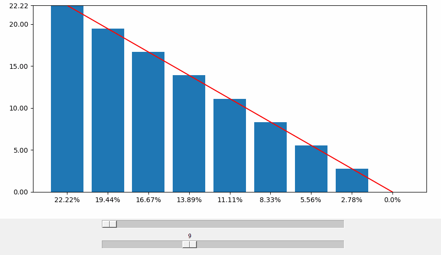

# UI Percent Scaler

## Description

This project is intended as a personal study of the D3.js svg-manipulation library. The Ui Percent Scaler is best demonstrated visually:



The value of each bar is a percentage of the sum of the range of each bar that is determined by a linear slope controlled by the Slope slider. The Element Count controls the amount of data points represented along the x-axis. The sum of all data points is equal to 100%.

The visualization is designed to be both desktop and mobile-friendly with responsive X-axis labels that adjust their orientation based on the viewport size.

## How to Use

There are two sub-directories. A Python version, and a beta vanilla js version.

1. **Clone the repository** :

   ```bash
   git clone https://github.com/dv1651st/ui-percent-scaler
   ```
2. **Navigate to the project directory** :

   ```bash
   cd ui-percent-scaler
   ```
3. **Open `index.html` in a browser** to view the visualization.
4. **Interact with Sliders** :
   Use the provided sliders to adjust the element count and slope. The chart will update in real-time as you make changes.

## To do:

* [ ] Use HTML for the x-axis labels instead of D3.js.
* [ ] Bring back the bottom border for the graph area.
* [ ] Make sure 50% on Slope slider translates to a horizontal slope across all values of Element Count.

## Contributing

Pull requests are welcome. For major changes, please open an issue first to discuss what you would like to change.

## License

[MIT](https://choosealicense.com/licenses/mit/)
